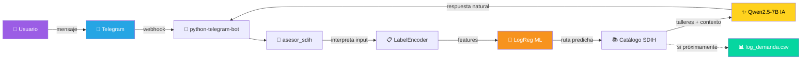

<div align="center">

# 🤖 Asesor Virtual SDIH

### Bot inteligente que recomienda talleres de IA según el perfil del usuario

[](https://www.python.org/)
[](https://scikit-learn.org/)
[](https://huggingface.co/)
[](https://core.telegram.org/bots)
[](https://jupyter.org/)

[](https://github.com/SalazarDukeImpactHub/asesor-sdih-bootcamp)
[](LICENSE)
[](#)
[](#)

**Proyecto Final · Bootcamp de Inteligencia Artificial · 2026**
_Autora: **Jennifer Salazar Duque**_

[🌐 Sitio Web](https://talleres.salazardukeimpacthubteam.com/) ·
[💬 Bot en Telegram](https://t.me/SDIH_asesor_bot) ·
[📄 Documentación Técnica](docs/Documentacion_Tecnica.pdf) ·
[🎥 Video Demo](#)

</div>

---

## 📑 Tabla de Contenidos

- [✨ ¿Qué hace?](#-qué-hace)
- [🏗️ Arquitectura](#️-arquitectura)
- [🧰 Stack tecnológico](#-stack-tecnológico)
- [📊 Datos](#-datos)
- [🚀 Cómo correrlo](#-cómo-correrlo)
- [📁 Estructura del proyecto](#-estructura-del-proyecto)
- [🔐 Seguridad](#-seguridad)
- [⚠️ Limitaciones conocidas](#️-limitaciones-conocidas)
- [🎬 Demo](#-demo)
- [💡 Sobre SDIH](#-sobre-sdih)
- [📜 Licencia](#-licencia)

---

## ✨ ¿Qué hace?

El bot vive en Telegram. Cuando un usuario le escribe contándole sobre sí mismo (rol, objetivo, nivel), el sistema:

> 1️⃣ **Interpreta** el mensaje y extrae perfil + objetivo + nivel + área de interés
> 2️⃣ **Predice con ML** (Regresión Logística multiclase) la ruta de aprendizaje más adecuada entre **5 rutas posibles**
> 3️⃣ **Genera con IA** una recomendación personalizada de 1-2 talleres específicos
> 4️⃣ **Registra demanda**: si recomienda un taller marcado como _"próximamente"_, lo guarda en un CSV — esto convierte al bot en un **sensor de demanda** que le indica a SDIH qué construir primero

### 🎯 Las 5 rutas de aprendizaje

| Ruta | Talleres | Audiencia |
|:-:|:-:|---|
| 🛠️ **DEV** | 5 | Desarrolladores |
| 🚀 **EMPRENDEDOR** | 6 | Fundadores y emprendedores |
| 💼 **PROFESIONAL** | 4 | Profesionales corporativos |
| 💚 **BIENESTAR** | 4 | Procesos personales y salud mental |
| 🎯 **ESTRATÉGICA** | 4 | C-Level y gobernanza |

**Total:** 22 talleres distribuidos (9 disponibles ✅ · 13 próximamente 🔜)

---

## 🏗️ Arquitectura



> El bot **NO depende de servicios externos como Botpress**: la integración Telegram ↔ Python es directa, lo cual simplifica el despliegue y elimina puntos de falla intermedios.

---

## 🧰 Stack tecnológico

<table>
<tr><th>Capa</th><th>Tecnología</th><th>Rol</th></tr>
<tr><td>🐍 Lenguaje</td><td>Python 3.11</td><td>Core del sistema</td></tr>
<tr><td>📊 ML</td><td>scikit-learn 1.5+</td><td>LogisticRegression multiclase, PCA, LabelEncoder</td></tr>
<tr><td>🤖 IA Generativa</td><td>Qwen2.5-7B-Instruct (HF)</td><td>Respuestas en lenguaje natural</td></tr>
<tr><td>💬 Bot</td><td>python-telegram-bot v20+</td><td>Integración con Telegram (asyncio)</td></tr>
<tr><td>📓 Entorno</td><td>Jupyter + Anaconda</td><td>Desarrollo y ejecución</td></tr>
<tr><td>🔐 Secretos</td><td>python-dotenv</td><td>Gestión segura de tokens</td></tr>
</table>

---

## 📊 Datos

| Atributo | Valor |
|---|---|
| **Tamaño del dataset** | 500 registros sintéticos |
| **Distribuciones** | Basadas en DANE 2024 + MinTIC Colombia |
| **Variables predictoras** | `perfil`, `objetivo`, `nivel`, `area_interes` |
| **Variable objetivo** | `ruta_recomendada` (multiclase, 5 valores) |
| **Split** | 80% train · 20% test (estratificado) |

<details>
<summary>📈 <b>Ver métricas del modelo</b></summary>

| Métrica | Valor |
|---|---|
| Accuracy en test | ~100% (función determinística) |
| AUC promedio (macro) | 1.00 |
| Algoritmo | Logistic Regression multinomial |
| Solver | L-BFGS |
| Iteraciones máx | 1000 |

</details>

---

## 🚀 Cómo correrlo

### 📋 Requisitos previos

- 🐍 Anaconda o Miniconda
- 🤗 Cuenta gratuita en [Hugging Face](https://huggingface.co)
- 💬 Bot creado con [@BotFather](https://t.me/BotFather) en Telegram

### ⚙️ Instalación

```bash
# 1. Clonar el repo
git clone https://github.com/SalazarDukeImpactHub/asesor-sdih-bootcamp.git
cd asesor-sdih-bootcamp

# 2. Crear entorno conda
conda create -n sdih_asesor python=3.11 -y
conda activate sdih_asesor

# 3. Instalar dependencias
pip install -r requirements.txt

# 4. Configurar tokens
cp .env.example .env
# Editar .env con tus tokens reales
```

### ▶️ Ejecución

```bash
jupyter notebook
```

> Abrir `Asesor_SDIH_PyMEs.ipynb` y ejecutar las celdas en orden (1 a 16). La última celda inicia el bot — cuando veas `✅ Bot Telegram conectado`, mandá `/start` al bot en Telegram.

---

## 📁 Estructura del proyecto

| 📄 Archivo / Carpeta | Descripción |
|---|---|
| `📘 README.md` | Documentación principal del proyecto |
| `📓 Asesor_SDIH_PyMEs.ipynb` | Notebook con todo el código (ML + IA + Bot) |
| `📊 dataset_sdih.csv` | Dataset sintético de 500 perfiles generado |
| `📈 log_demanda_talleres.csv` | Log de talleres "próximamente" solicitados |
| `📦 requirements.txt` | Dependencias Python para reproducir el entorno |
| `🔐 .env.example` | Template de variables de entorno (sin tokens reales) |
| `🙈 .gitignore` | Exclusiones de Git (protege el `.env`) |
| `📂 docs/` | Documentación técnica completa en PDF |

---

## 🔐 Seguridad

> ⚠️ **NUNCA** subir el archivo `.env` real al repositorio.

Los tokens (Hugging Face, Ngrok, Telegram) se gestionan vía variables de entorno en el archivo `.env` local, excluido del repositorio mediante `.gitignore`. Esta es una **práctica estándar de la industria** para prevenir filtración de credenciales.

```python
import os
from dotenv import load_dotenv
load_dotenv()

HF_TOKEN = os.getenv("HF_TOKEN")  # Lee de .env, no del código
```

---

## ⚠️ Limitaciones conocidas

<table>
<tr><th>#</th><th>Limitación</th><th>Mitigación</th></tr>
<tr>
<td>1</td>
<td><b>Dataset sintético</b></td>
<td>Reemplazar por datos reales de inscripción en v2</td>
</tr>
<tr>
<td>2</td>
<td><b>Cobertura del modelo</b> en combinaciones raras (~3 registros)</td>
<td>Sampling estratificado por combinaciones poco representadas</td>
</tr>
<tr>
<td>3</td>
<td><b>Alucinación del LLM</b> (inventa nombres de talleres)</td>
<td>Prompt engineering estricto + temperatura 0.3 + limpieza posterior</td>
</tr>
<tr>
<td>4</td>
<td><b>Tono regional</b> (LLM usa expresiones rioplatenses)</td>
<td>Restricciones explícitas en prompt: lista negra de palabras</td>
</tr>
</table>

---

## 🎬 Demo

### 💬 Ejemplo de conversación

```
👤 Usuario:  Soy emprendedora colombiana y quiero lanzar mi negocio usando IA

🤖 Bot:  Te recomiendo comenzar con el taller "Del Sueño a la Convocatoria"
        para definir tu propósito y convocar a tu equipo o aliados. Además,
        puedes estar atento al taller "IA para Marketing y Ventas en PyMEs",
        que próximamente estará disponible para mejorar tus estrategias
        comerciales.
```

- 🎥 **Video de presentación:** _(pendiente — agregar link cuando esté subido)_
- 💬 **Probá el bot en vivo:** [@SDIH_asesor_bot](https://t.me/SDIH_asesor_bot)

---

## 💡 Sobre SDIH

> _**Salazar Duke Impact Hub** es una empresa colombiana de formación en IA para emprendedores, desarrolladores y profesionales en LATAM._

🌐 **Web:** [talleres.salazardukeimpacthubteam.com](https://talleres.salazardukeimpacthubteam.com/)

---

## 📜 Licencia

Distribuido bajo licencia **MIT**.

Proyecto académico desarrollado como entrega final del Bootcamp de Inteligencia Artificial 2026.

---

<div align="center">

**⭐ Si te sirvió, dejá una estrella en GitHub ⭐**

Hecho con 💜 en Colombia 🇨🇴

</div>
